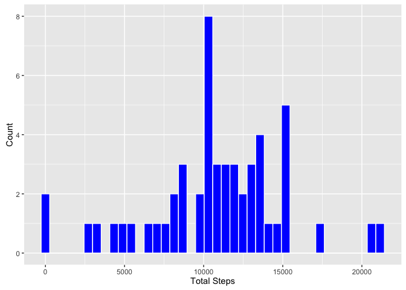
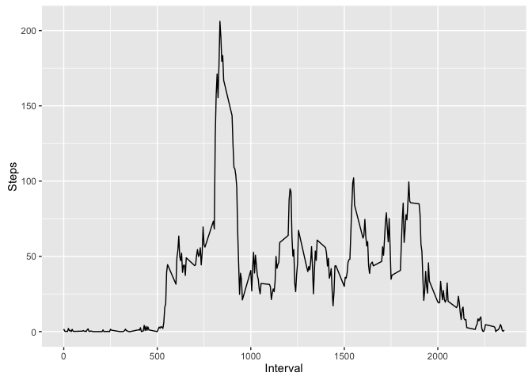

# Reproducible Research: Peer Assessment 1


```r
activityDataFile = "activity.csv"
activityDataUrl  = "https://d396qusza40orc.cloudfront.net/repdata%2Fdata%2Factivity.zip"
```


```r
## include libraries
library('ggplot2')
library('data.table')

## Set default lang and number
Sys.setenv(LANG = "en")
Sys.setlocale("LC_TIME", "en_US")
```

```
## [1] "en_US"
```

```r
options(scipen=999)
```

## Loading and preprocessing the data

Download the [activity data url](https://d396qusza40orc.cloudfront.net/repdata%2Fdata%2Factivity.zip) and extract it into the file activity.csv. Then load the CSV data into a data.table.

### Loading Data

```r
###
# Loading Data
###

## if the data file not exists
if( ! file.exists( activityDataFile ) ) {
  
  ## download the zip file into a temp file
  temp <- tempfile()
  download.file( activityDataUrl, temp )
  
  ## unzip the content from the zip file
  unzip( temp, files = activityDataFile )
  
  ## remove the zip file
  unlink(temp)
}
```

### Preprocessing Data


```r
###
# Preprocessing Data
###

activityData <- fread( activityDataFile)
activityData$date <- as.Date(activityData$date,"%Y-%m-%d")
```

## What is mean total number of steps taken per day?

1. Calculate the total number of steps taken per day


```r
## aggregate by the sum of steps
activityStepsPerDay <- aggregate(steps ~ date, data = activityData, sum ,na.rm = TRUE)
```

2. Make a histogram of the total number of steps taken each day

```r
## plot the histogram
qplot(
  activityStepsPerDay$steps,
  xlab='Total Steps',
  ylab='Count',
  bins=40,
  geom="histogram",
  col=I("white"),
  fill=I("blue")
)
```

<!-- -->

3. Calculate and report the mean and median of the total number of steps taken per day

```r
## calculate the mean and median
activityStepsPerDay <- aggregate(steps ~ date, data = activityData, sum ,na.rm = TRUE)
meanTotalStepsPerDay <- mean(activityStepsPerDay$steps)
medianTotalStepsPerDay <- median(activityStepsPerDay$steps)
```

The mean of total number of steps taken per day is *10766.1886792* and the median
is  *10765*

## What is the average daily activity pattern?

1. Make a time series plot (i.e. 𝚝𝚢𝚙𝚎 = "𝚕") of the 5-minute interval (x-axis) and the average number of steps taken, averaged across all days (y-axis)


```r
activityAvgDailyActivity <- aggregate(steps ~ interval, data = activityData, mean ,na.rm = TRUE)
qplot(
  x=activityAvgDailyActivity$interval,
  xlab='Interval',
  y=activityAvgDailyActivity$steps,
  ylab='Steps',
  geom=c("line")
)
```

<!-- -->

2. Which 5-minute interval, on average across all the days in the dataset, contains the maximum number of steps?

## Imputing missing values


```r
missing <- !complete.cases(activityData)
```

## Are there differences in activity patterns between weekdays and weekends?
